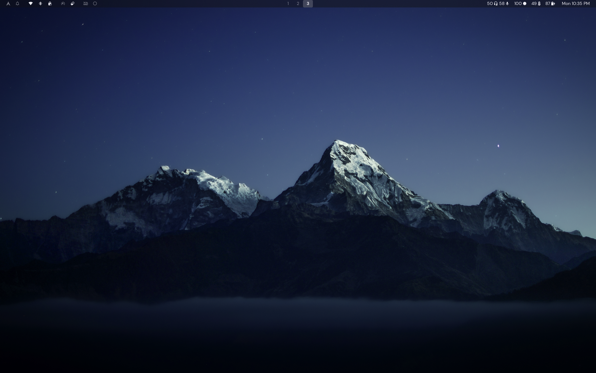
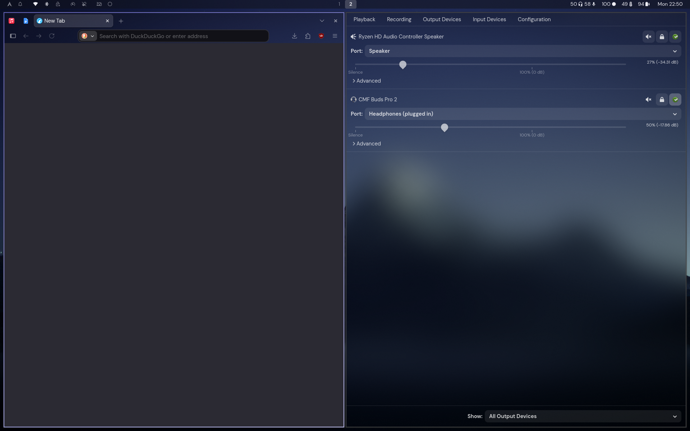

# dotfiles




## Getting Started

### Step 1: Install packages

Run the package install script:

```bash
./packages/install.sh
```

### Step 2: Adjust config

Go into the following folders and follow the README's instructions inside each of them:

- antimicrox
- gtk
- hypr
- librewolf
- waybar
- zed

### Step 3: Link files

From the repository root, link all files using `stow`:

```bash
stow antimicrox bashrc cursor fonts gtk hypr kitty Kvantum librewolf lsfg-vk MangoHud mpv swappy swaync waybar zed
```
