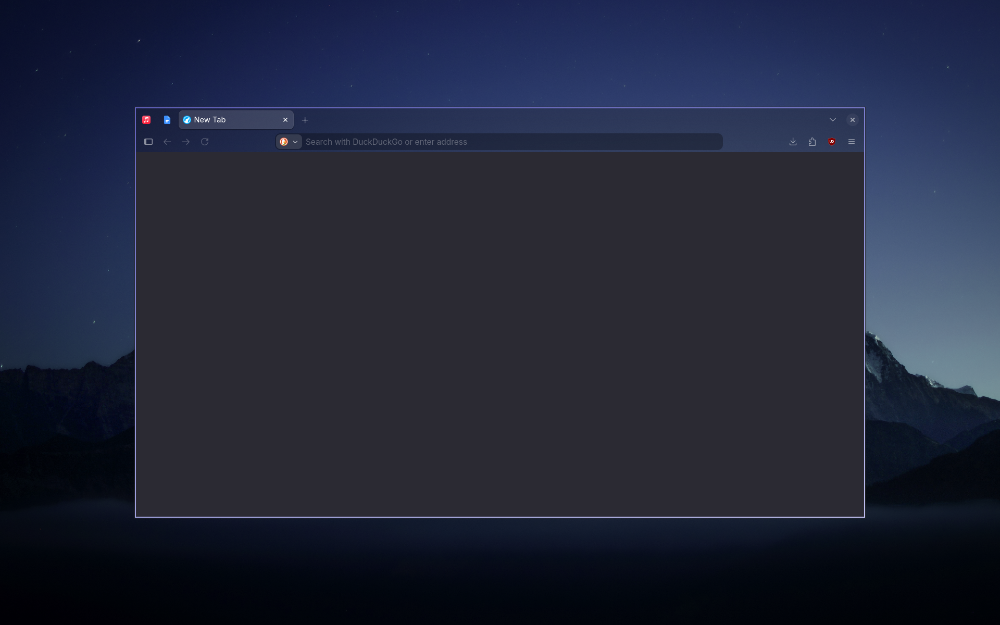

# LibreWolf

This module contains a `userChrome.css` stylesheet that makes the tab bar transparent.

> [!NOTE]
> `userChrome.css` styling is not officially supported by Mozilla, so support for these files may change and could break after future LibreWolf updates.

## Preview



## Installation

1. Go to `about:addons` in Librewolf and select any theme other than "light" or "dark" (these override userChrome.css styles).

2. Go to `about:config` in LibreWolf and set `toolkit.legacyUserProfileCustomizations.stylesheets` to `true`.

3. Go to `about:profiles` in LibreWolf and copy the name of the **Root Directory** folder.

4. Rename `<repo-root>/librewolf/.config/librewolf/librewolf/<profile-directory>` to match that folder name.

5. From the repository root, link the module using Stow:

```bash
stow librewolf
```
